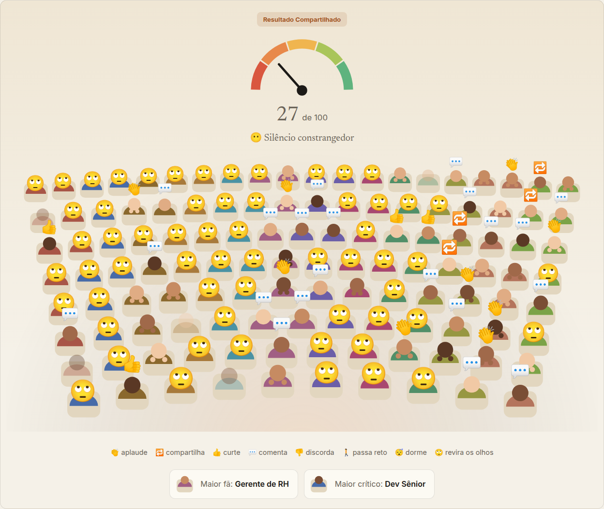
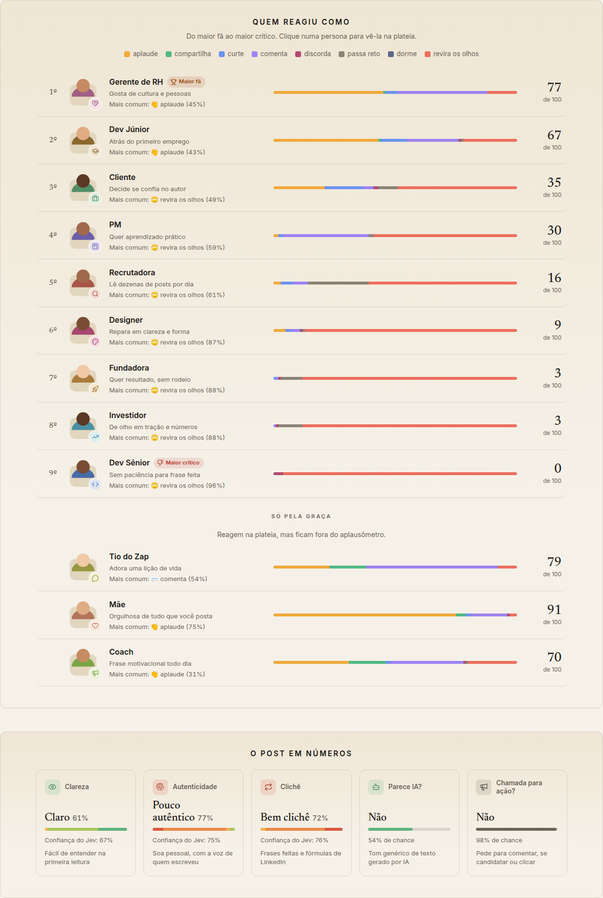
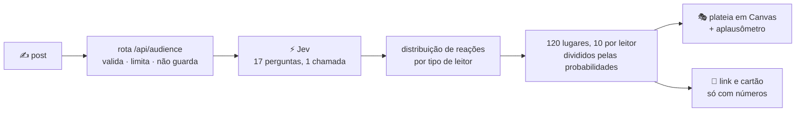
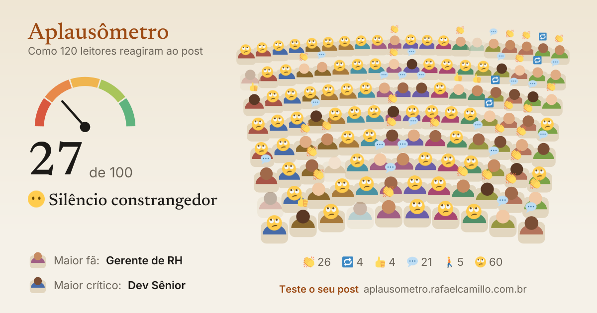

<h1 align="center">👏 Aplausômetro</h1>

<p align="center">
  <b>Cole seu post do LinkedIn e veja uma plateia de 120 leitores reagir, enquanto você escreve.</b><br>
  Cada pessoa na plateia é uma probabilidade calibrada do <a href="https://docs.typesafe.ai">Jev</a>, da TypeSafe.
</p>

<p align="center">
  <a href="https://github.com/rf-camillo/jev-aplausometro/actions/workflows/ci.yml"></a>
  <a href="LICENSE"></a>
  
  
  
</p>

<p align="center">
  <a href="https://aplausometro.rafaelcamillo.com.br"><b>aplausometro.rafaelcamillo.com.br</b></a> ·
  <a href="#-como-funciona">Como funciona</a> ·
  <a href="#-por-que-o-jev">Por que o Jev</a> ·
  <a href="#-a-plateia-reage-como-um-leitor">Sensibilidade</a> ·
  <a href="#-calibrando-as-perguntas">Calibração</a> ·
  <a href="#-rodando-localmente">Rodar localmente</a>
</p>

<p align="center">
  <picture>
    <source media="(prefers-color-scheme: dark)" srcset="docs/assets/audience-dark-theme.png">
    
  </picture>
</p>

<p align="center"><sub>Um resultado real: o clássico <i>“Fui demitido hoje. E sabe o que eu aprendi? Que a vida é feita de ciclos. Gratidão!”</i>. O dev sênior revira os olhos (96%), a mãe aplaude (75%, mas fica fora da conta) e o aplausômetro para em <b>27, silêncio constrangedor</b>.</sub></p>

---

## ✨ O que é

Uma plateia de programa de auditório para o seu post. Você escreve, para de digitar, e 120 leitores reagem: aplaudem, compartilham, curtem, comentam, discordam, passam reto, dormem ou reviram os olhos. No alto, o **aplausômetro** vai de 0 a 100 e dá o veredito, de _“Vaia! 🍅”_ a _“Ovação de pé! 🎉”_.

- 🎭 **12 tipos de leitor**, cada um no seu setor da plateia e com o seu rosto: recrutadora, dev sênior, dev júnior, fundadora, investidor, gerente de RH, PM, designer e cliente, mais três que reagem **só pela graça** e ficam fora do aplausômetro: o tio do zap, a sua mãe e um coach de LinkedIn (a mãe aplaude qualquer coisa, e o coach e o tio adoram justamente o clichê que os outros punem).
- ⚡ **Em tempo real, sem botão**: a plateia reage 700 ms depois da última tecla (e no máximo a cada 4 s, para quem escreve do zero não esbarrar no limite), e a linha de status mostra quanto o Jev levou. Para um post curto, Ctrl ou ⌘ + Enter.
- 🏆 **Do maior fã ao maior crítico**: cada leitor do aplausômetro com a sua nota de 0 a 100, a reação mais comum e a barra de reações, com a porcentagem de cada cor ao passar o mouse.
- 📊 **O post em números**: clareza, autenticidade e clichê em palavras (“Muito claro”, “Puro clichê”), com uma barra mostrando **a distribuição que o Jev deu** entre os cinco níveis e a confiança dele; “parece IA?” e “chamada para ação?” como sim ou não, com a chance. Quando o Jev hesita entre dois níveis distantes, como “Pouco autêntico” e “Autêntico”, o cartão diz **“Dividido”** em vez de uma média que cairia em “Neutro”, um nível em que ele mal acredita. A cor diz se é bom ou ruim para o post.
- 🔦 **Uma plateia que responde**: passe o mouse numa pessoa para saber quem ela é e como reagiu; clique (ou toque) para acender o setor dela e ver o resumo daquele leitor, com a confiança do Jev na leitura. A lista, o fã e o crítico fazem o mesmo.
- 🌗 **Tema claro e escuro**, seguindo o sistema na primeira visita.
- 🔗 **Compartilhável sem guardar nada**: o link leva só os números, nunca o texto. O post para o LinkedIn já sai escrito, e o cartão vira a prévia do link.

<p align="center">
  <picture>
    <source media="(prefers-color-scheme: dark)" srcset="docs/assets/cast-dark-theme.png">
    
  </picture>
</p>

<p align="center">
  <picture>
    <source media="(prefers-color-scheme: dark)" srcset="docs/assets/panels-dark-theme.png">
    
  </picture>
</p>

## ⚙️ Como funciona

Uma única chamada ao Jev faz **17 perguntas tipadas** sobre o post, respondidas em paralelo:

- 12 perguntas de **escolha**, uma por tipo de leitor: _“Como uma recrutadora de tecnologia reage a este post?”_, com as oito reações como opções, cada uma descrita para não se sobrepor às outras (_“Curte: gosta, mas não vai além de um clique”_);
- 3 de **nota** (clareza, clichê, autenticidade), cada nível da rubrica com o que ele quer dizer (_“Neutro: informativo e impessoal, sem a voz de quem escreve”_), e 2 de **sim ou não** (parece IA, tem chamada para ação).



**Cada pessoa na plateia é uma probabilidade.** O Jev não devolve uma reação por leitor, devolve a distribuição inteira: a recrutadora, diante do post clichê, revira os olhos com 61% de probabilidade, passa reto com 25%, e o resto se divide entre curtir e comentar. Cada tipo de leitor tem **10 lugares**, e cada lugar vale um décimo das reações dele: os 10 lugares da recrutadora viram 6 que reviram os olhos, 2 que passam reto, 1 que curte e 1 que comenta (método dos maiores restos). Perguntar 120 vezes a mesma coisa daria 120 respostas iguais; a plateia é a distribuição desenhada, não 120 opiniões inventadas.

Os lugares de cada tipo de leitor são embaralhados com uma semente tirada do texto, então **o mesmo post sempre produz a mesma plateia**, e um link compartilhado reproduz exatamente o que o autor viu.

O **aplausômetro** é a média, entre os 9 tipos de leitor que contam (e pesam igual), do quanto cada reação vale de aplauso: aplaudir e compartilhar valem 1, comentar 0,75, curtir 0,6, passar reto 0,2, dormir 0,05, e discordar e revirar os olhos 0.

## ⚡ Por que o Jev

O Jev é um modelo “System One”: não escreve texto, responde perguntas tipadas com **probabilidades calibradas**. É exatamente o que uma plateia precisa, e o que torna o tempo real viável:

|                                          | Medido neste projeto                                                     |
| ---------------------------------------- | ------------------------------------------------------------------------ |
| Latência de uma avaliação (17 perguntas) | **mediana de 308 ms**, medida do Brasil, com a ida e volta pela internet |
| Tokens por avaliação                     | cerca de 2.750, só de entrada                                            |
| Custo por avaliação                      | cerca de **US$ 0,00012** (10 mil avaliações por pouco mais de US$ 1)     |

Um modelo de texto teria de escrever as 17 respostas e devolver as probabilidades como texto, sem garantia de calibração; o Jev devolve a distribuição de cada pergunta direto, numa chamada que cabe na pausa entre duas frases.

> **Nota de quem testou:** o Jev também está no AI Gateway da Vercel, mas ali a primeira chamada levou 6,8 s e as seguintes voltaram `429 No access to this model at this time`, mesmo com créditos. Pela API direta da TypeSafe, 10 de 10 chamadas responderam com mediana de 279 ms. O projeto usa a API direta.

## 🔬 A plateia reage como um leitor?

Uma plateia bonita que não muda com o texto não vale nada. A [checagem de sensibilidade](docs/sensitivity.md) compara pares de posts que diferem em **um só aspecto** e verifica se a plateia se move na direção certa. Rodada com o Jev de verdade (`npm run sensitivity`) e publicada como saiu:

| Checagem             | O que muda no post                                                          | Resultado                                                 |
| -------------------- | --------------------------------------------------------------------------- | --------------------------------------------------------- |
| ✅ Clichê            | acrescenta _“Gratidão ao universo… Nunca desista dos seus sonhos #mindset”_ | aplauso **79 → 45**, revirar de olhos **2% → 36%**        |
| ✅ Tom de IA         | troca um relato pessoal por _“Em um mundo cada vez mais dinâmico…”_         | aplauso **47 → 2**, “parece IA” **21% → 85%**             |
| ✅ Chamada para ação | acrescenta _“Candidate-se pelo link nos comentários”_                       | chamada para ação **7% → 98%**, o resto quase parado      |
| ✅ Paráfrase         | o mesmo conteúdo com outras palavras                                        | aplauso **79 → 75**, plateia estável                      |
| ✅ Repetição         | o mesmo post, duas chamadas                                                 | aplauso **79 → 79**, mas não idêntico: distância de 0,032 |

A última linha é um achado: **o Jev não é totalmente determinístico**, varia um pouco entre chamadas (numa rodada anterior, o mesmo post deu 79 e 78; por isso a checagem aceita até 2 pontos). Por isso o app guarda os últimos 50 resultados: o mesmo post mostra sempre a mesma plateia para quem está escrevendo.

## 🎯 Calibrando as perguntas

A checagem de sensibilidade diz se a plateia se move; a [calibração](docs/calibration.md) diz se ela acerta. São 21 posts variados (técnico com números, vaga, rodada de investimento, humblebrag, texto de IA, curso milagroso, “bom dia, rede”, desabafo de burnout…), cada um com o que um leitor esperaria: a faixa do aplauso, quem gosta, quem não gosta e as notas. Cada versão das perguntas roda no mesmo conjunto (`npm run calibrate`), e o relatório compara as versões lado a lado.

|                                 | primeira versão | versão no ar |
| ------------------------------- | --------------- | ------------ |
| Expectativas                    | 75 de 78        | **78 de 78** |
| Aplauso, do pior ao melhor post | 5 a 77          | **1 a 85**   |
| Confiança nas notas             | 71%             | 73%          |

O que a calibração mostrou e mudou:

- **A nota de clichê estava viciada:** post só informativo (uma vaga, uma rodada de investimento) saía “Bem clichê”. Com cada nível descrito, e a pergunta dizendo que informação sem frase de efeito não é clichê, eles viraram “Original” ou “Pouco clichê”, e os clichês de verdade continuaram no topo.
- **Mãe, coach e tio do zap inflavam os posts ruins** em 10 a 14 pontos, porque aplaudem justamente o clichê. Continuam na plateia, fora da conta.
- **Faltava discordar:** um dev sênior que comentava para desmontar o post somava aplauso. Com a reação “discorda”, a opinião arrogante sobre testes caiu de 13 para 1, e nenhum outro post teve discordância como reação principal.
- **Um experimento descartado:** descrever o que cada leitor valoriza e o que o irrita subiu a confiança em um ponto, mas fez a recrutadora passar reto por uma vaga. Ficou registrado no relatório, e a calibração ganhou a expectativa que faltava para pegar isso.

A confiança média nas personas ficou perto de 53%, e isso é esperado: ela é calibrada, e prever como “uma recrutadora” reage a um post é incerto de verdade. Texto mais longo não muda isso; só mais informação mudaria, como saber quem escreve.

## 🔗 Compartilhar sem guardar nada

Não há banco de dados. O link `/r/<código>` carrega o resultado inteiro em **137 bytes** (cerca de 183 caracteres): o aplausômetro, as cinco métricas com a distribuição das notas, a distribuição de cada tipo de leitor e a semente da plateia. **O texto do post nunca vai no link.**

Quem abre o link cai na própria página do Aplausômetro, com o resultado compartilhado no palco e o campo vazio esperando o post dela; ao escrever, a plateia passa a reagir ao post novo. O botão _Postar no LinkedIn_ abre o post já escrito, com a nota, o fã, o crítico e o link, e o LinkedIn mostra como prévia o cartão gerado no servidor:

<p align="center">
  
</p>

O formato do link é **versionado e congelado**: a ordem das personas, das reações e das métricas no código não segue as listas do app, então mudar as personas não embaralha links já compartilhados. A versão 2 acrescentou a distribuição das notas, e a versão 3, a reação “discorda”; os links antigos continuam abrindo (os da versão 1 só não mostram a distribuição, e nenhum antigo tem quem discorda). Um teste de ouro por versão lê um link fixo e confere cada número.

## 🔒 Privacidade e segurança

- O texto vai para a API da TypeSafe só para a avaliação. **O Aplausômetro não guarda nada**: não há banco de dados, e o servidor registra apenas o código do erro, nunca o texto (um teste garante isso).
- O plano gratuito da Vercel não oferece retenção zero de dados no provedor, então a página pede, no fim, para não colar informações pessoais.
- A chave da TypeSafe fica só no servidor, e só é enviada para um endereço HTTPS da TypeSafe. As camadas do projeto proíbem os componentes do navegador de importar o código que a usa.
- **Cada avaliação custa**, então a rota se defende de quem quer gastá-la:
  - no máximo **20 avaliações por minuto** por cliente, com um bloco IPv6 (/64) contando como um só, e 60 por rede maior (/48), para um túnel gratuito não virar milhares de clientes; enquanto a pessoa digita, a página pergunta no máximo a cada 4 s, e se mesmo assim ouvir “devagar”, mantém a última plateia e tenta de novo em silêncio;
  - um **teto de gasto** de US$ 5 por dia (e 300 avaliações por minuto) em cada instância do servidor: passado dele, a plateia fica “lotada” até o dia virar;
  - pedidos de outros sites são recusados (`Origin` e `Sec-Fetch-Site`), assim como corpos que não são JSON, o que impede um site qualquer de usar a API pelo navegador dos visitantes;
  - o corpo é lido até 16 KB e para ali, e a resposta do Jev tem limite de tamanho;
  - um 429 do Jev não é repetido, e uma falha dele ganha no máximo uma nova tentativa (com prazo maior quando a primeira estoura o tempo, porque o Jev parado há um tempo leva mais de 10 s para acordar).
- Cabeçalhos de segurança em todas as respostas: a página não pode ser embutida em outro site, tipos não são adivinhados, HSTS e uma política de conteúdo que bloqueia plugins, `<base>` e formulários para fora.
- A resposta da API diz cada tipo de leitor só pelo id: o texto que o Jev lê sobre cada persona fica no servidor.

## ⚠️ Limitações

- **É uma simulação, não uma previsão de engajamento.** As personas são descrições em uma frase; a plateia mostra como um modelo lê o texto por esses olhos, não quantas curtidas o post vai ter. A página diz isso no fim.
- **As personas são caricaturas de propósito.** O tio do zap e o coach de LinkedIn existem para a graça; um dev sênior de verdade pode adorar o seu post clichê.
- **Só português e só LinkedIn.** As perguntas, as personas e o contexto são do LinkedIn brasileiro.
- **O Jev está em acesso antecipado.** Se ele ficar fora do ar ou lento, a interface avisa que _“a plateia está lotada”_; não há modelo de reserva.

## 🧪 Qualidade

- **202 testes unitários** (Vitest) em 41 arquivos, um por módulo: cliente do Jev com novas tentativas e tempo limite, interpretação das respostas, divisão dos lugares, a geometria de uma pessoa e de quem está sob o mouse, a onda que se espalha pela plateia, as leituras das métricas, a ordem do ranking, a linha de status, o texto para o LinkedIn, o contrato da API, a sessão de avaliação (cache, cancelamento, sem pergunta repetida), as defesas da rota e o formato do link. Toda regra fica fora dos componentes, com cobertura de 99% das linhas e 92% dos caminhos (mínimos exigidos de 99% e 90%).
- **26 testes ponta a ponta** (Playwright), um arquivo por assunto, contra um Jev falso, no computador e no celular, encontrando os elementos pelo papel e pelo nome, como um leitor de tela: reação ao parar de digitar, o intervalo entre perguntas, o pedido de calma do servidor, cache, teclado, post curto, Jev fora do ar e o botão de tentar de novo, o elenco, o ranking, as métricas (inclusive uma nota dividida), o destaque pela lista, pelo fã e pela própria plateia, o LinkedIn com o texto pronto, o link compartilhado (inclusive um da versão 1), o cartão em PNG, movimento reduzido, o tema, os cabeçalhos de segurança e a recusa de pedidos de outros sites.
- **Acessibilidade verificada pelo axe** (WCAG 2 A e AA) nos dois temas, plateia descrita em texto para leitores de tela, tudo o que a plateia faz ao clique também disponível pelo teclado na lista, e animação desligada para quem pede menos movimento.
- **Camadas garantidas no build** pelo dependency-cruiser: `lib/core → lib/jev → lib/audience → lib/stage → lib/server → components → app`, com a lógica proibida de importar React e os componentes proibidos de importar o código do servidor.
- TypeScript estrito (com `exactOptionalPropertyTypes`, `noUncheckedIndexedAccess` e `verbatimModuleSyntax`), ESLint com checagem de tipos e as regras do Next, e CI com as actions fixadas por commit, `npm audit` e os testes no Node 20, 22 e 24.

## 🚀 Rodando localmente

Requer Node.js 20.9 ou mais novo e uma chave da [TypeSafe](https://console.typesafe.ai/keys).

```sh
git clone https://github.com/rf-camillo/jev-aplausometro.git
cd jev-aplausometro
npm install
cp .env.example .env.local        # preencha TYPESAFE_API_KEY
npm run dev                       # http://localhost:3000
```

| Comando                               | O que faz                                                          |
| ------------------------------------- | ------------------------------------------------------------------ |
| `npm run check`                       | formatação, lint, tipos, camadas e testes com cobertura            |
| `npm run e2e`                         | testes ponta a ponta (depois de `npm run build`)                   |
| `npm run try -- "texto"`              | avalia um post no terminal, com a plateia em emojis                |
| `npm run try -- --raw "texto"`        | o mesmo, com as respostas das métricas como o Jev mandou           |
| `npm run sensitivity`                 | roda a checagem de sensibilidade e reescreve `docs/sensitivity.md` |
| `npm run calibrate -- run v5`         | avalia o conjunto de calibração e guarda a versão                  |
| `npm run calibrate -- report <nomes>` | compara versões guardadas em `docs/calibration.md`                 |

## 🗂️ Estrutura

```
src/
  lib/core/       erros, hash, gerador com semente, cache LRU, novas tentativas, base64 de URL
  lib/jev/        cliente da API da TypeSafe e o formato das respostas
  lib/audience/   personas, reações, perguntas, interpretação, lugares, leituras, status, link,
                  o contrato da API e a sessão de avaliação
  lib/stage/      o auditório, uma pessoa, as poses, o medidor, quem está sob o mouse e a onda
  lib/server/     a rota da avaliação: leitura do pedido, limite por cliente, erros em português
  components/
    composer/     o campo do post, que cresce com o texto, os exemplos e o aviso de erro
    stage/        o palco: a plateia em Canvas, o ponteiro, o medidor, o fã e o crítico, o destaque
    persona/      o que mostra um tipo de leitor: avatar, fatos, selo e barra de reações
    cast/         o elenco, antes do primeiro post
    results/      o ranking dos leitores e o post em números
    share/        o painel de compartilhar e o cartão, peça por peça
    hooks/        o tempo real (espera, cancelamento e cache) e o destaque de uma persona
    theme/        tema claro e escuro, sem piscar, e as cores desenhadas em JavaScript
    layout/ icons/ a moldura da página, o rodapé e os logos
  app/            páginas, a rota da API, os cartões gerados no servidor e um CSS por peça
e2e/              testes ponta a ponta e o Jev falso
scripts/          avaliação pelo terminal, a checagem de sensibilidade e a calibração
```

<p>
  
</p>

## 📄 Licença

[MIT](LICENSE) © Rafael Camillo. As fontes dos cartões estão sob a SIL Open Font License, veja [assets/fonts](assets/fonts/README.md).
